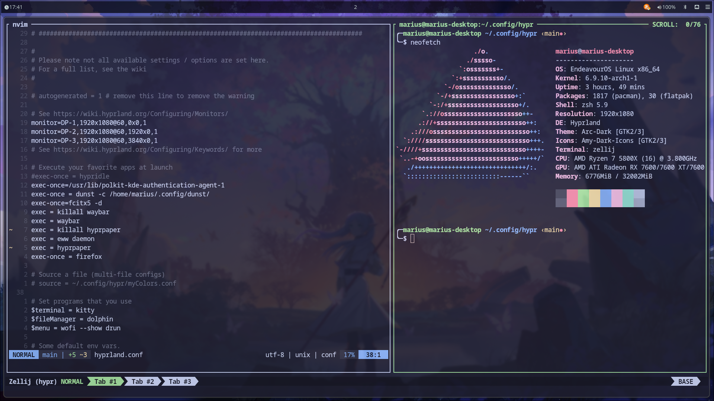

# My Dotfiles

Welcome to my dotfiles repository! This repository contains my personal configuration files for various tools and applications that I use. 

## Screenshots




## Contents

- `.config/wofi/`: My Wofi configuration files with custom themes and settings.
- `.config/hypr/`: My Hypr configuration files for window management.
- `.config/nvim/`: My Neovim configuration files with plugins and key mappings.
- `.config/kitty/`: My Kitty terminal emulator configuration files with custom themes
- `.config/waybar/`: My Waybar configuration files with custom modules and styles.
- `.config/eww/`: My Eww config files for the quick conrol panel 
- `bin`: A few custom scripts, that get indexed by the .zshrc
- `.zshrc`: My Zsh configuration file with Oh My Zsh plugins and themes.

## Installation

To install these dotfiles, you can clone the repository to your config folder 

```sh
git clone --recursive https://github.com/Marsimplodation/dotfiles.git dotfiles
cp -r dotfiles/* ~/
```

## Credits

background image:
https://wallpapersden.com/frieren-hd-frieren-beyond-journey-s-end-wallpaper/1920x1080/
