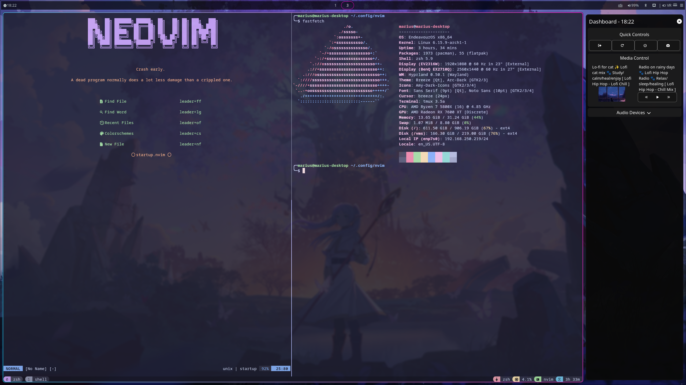

# My Dotfiles

Welcome to my dotfiles repository! This repository contains my personal configuration files for various tools and applications that I use.

## Screenshots



## Contents
* `hypr/`: My Hypr configuration files for window management.
* `nvim/`: My Neovim configuration files with plugins and key mappings.
* `kitty/`: My Kitty terminal emulator configuration files with custom themes.
* `waybar/`: My Waybar configuration files with custom modules and styles.
* `eww/`: My Eww config files for the quick control panel.
* `bin/`: Custom scripts indexed by `.zshrc`.
* `.zshrc`: My Zsh configuration file with Oh My Zsh plugins and themes.

## Required Packages

Before installing the dotfiles, make sure the following packages are installed on Arch Linux:

```sh
sudo pacman -S hyprland hyprpaper waybar noto-fonts nerd-fonts tmux git neovim zsh
```

Also install https://elkowar.github.io/eww/

## Installation

To install these dotfiles using the install script:

1. **Download the install script**:

```sh
curl -fsSL -o ~/dotfiles-install.sh https://raw.githubusercontent.com/Marsimplodation/dotfiles/main/bin/dotfiles
```

2. **Make it executable**:

```sh
chmod +x ~/dotfiles-install.sh
```

3. **Run the install command**:

```sh
~/dotfiles-install.sh install
```

This will:

* Install TPM (Tmux Plugin Manager) if not present.
* Install Oh My Zsh if not present.
* Pull the dotfiles repository and copy the configuration files into the appropriate locations.

> **Note:** The script should be run as your regular user, not as root.
> **Note:** After installing, configure `hyprpaper` or any other system-specific settings.

## Credits

Background image in screenshots:
[Frieren – Beyond Journey’s End Wallpaper](https://wallpapersden.com/frieren-hd-frieren-beyond-journey-s-end-wallpaper/1920x1080/)
